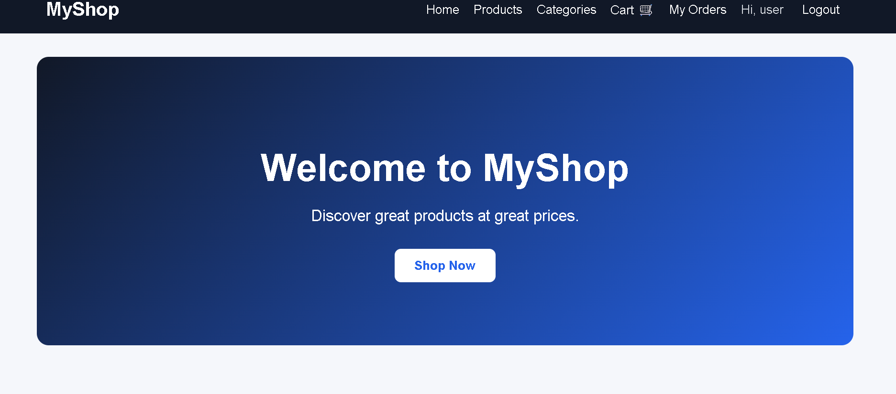
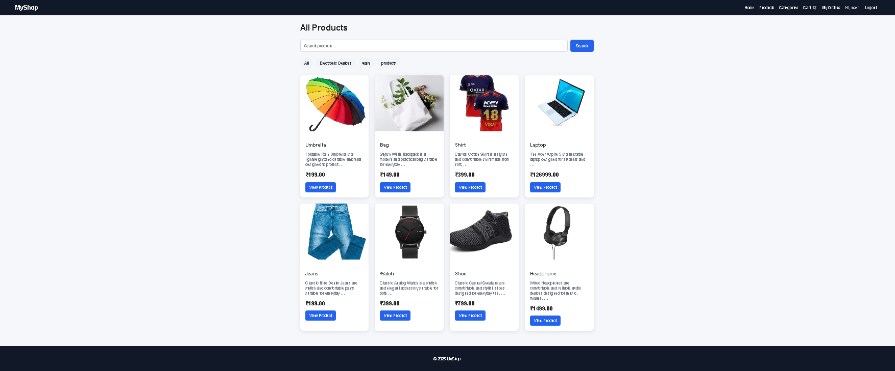
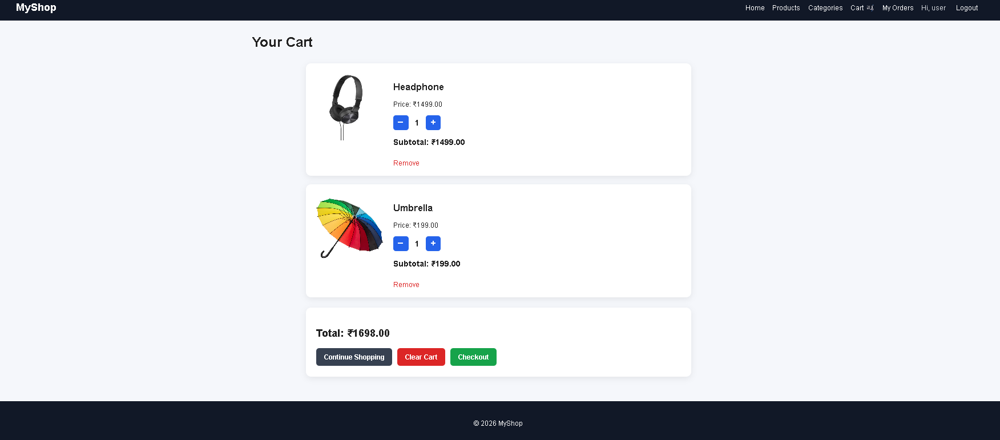
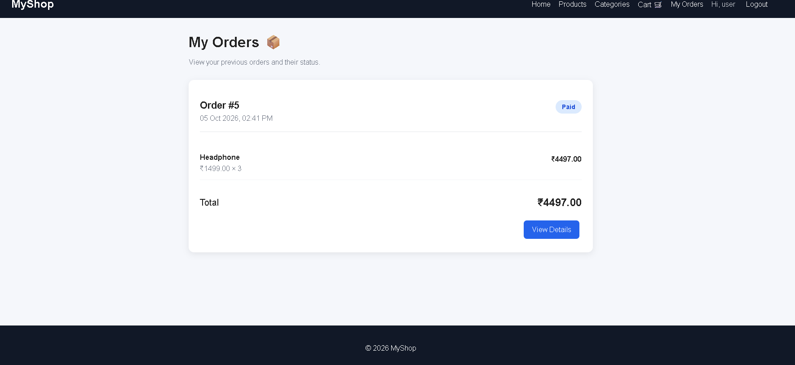

# 🛒 Django E-Commerce

A full-stack e-commerce web application built using **Python and Django**.

This project allows users to browse products, add products to a shopping cart, place orders, and manage their accounts.

## 🚀 Features

- 👤 User Registration
- 🔐 User Login & Logout
- 🛍️ Product Listing
- 🔎 Product Search
- 📂 Product Categories
- 📄 Product Details
- 🛒 Shopping Cart
- ➕ Increase Cart Quantity
- ➖ Decrease Cart Quantity
- ❌ Remove Products from Cart
- 🧹 Clear Cart
- 📦 Checkout
- 📋 Order Management
- 💳 Payment Method Selection
- 🖼️ Product Image Upload
- 👨‍💼 Django Admin Panel
- 📱 Responsive User Interface

## 🛠️ Technologies Used

### Backend
- Python
- Django

### Frontend
- HTML
- CSS
- JavaScript

### Database
- SQLite

### Tools
- Git
- GitHub
- Visual Studio Code

## 📁 Project Structure

```text
Django-Ecommerce/
│
├── accounts/          # User authentication
├── cart/              # Shopping cart
├── ecommerce/         # Main Django project
├── orders/            # Order management
├── payments/          # Payment functionality
├── store/             # Products and categories
│
├── templates/         # HTML templates
├── static/            # CSS and static files
├── media/             # Uploaded product images
│
├── manage.py
├── requirements.txt
├── .gitignore
└── README.md

```

## ⚙️ Installation

### 1. Clone the repository

```bash
git clone https://github.com/lohithkumar8763/Django-Ecommerce.git
```

### 2. Open the project folder

```bash
cd Django-Ecommerce
```

### 3. Create a virtual environment

```bash
python -m venv broenv
```

### 4. Activate the virtual environment

**Windows:**

```bash
broenv\Scripts\activate
```

**macOS / Linux:**

```bash
source broenv/bin/activate
```

### 5. Install the required packages

```bash
pip install -r requirements.txt
```

### 6. Apply database migrations

```bash
python manage.py migrate
```

### 7. Create an admin user

```bash
python manage.py createsuperuser
```

### 8. Start the development server

```bash
python manage.py runserver
```

Open the website:

```text
http://127.0.0.1:8000/
```

## 👨‍💼 Django Admin

Open:

```text
http://127.0.0.1:8000/admin/
```

You can use the Django admin panel to manage:

- Products
- Categories
- Users
- Orders
- Payments

## 🔄 How the Application Works

```text
User
  ↓
Browse Products
  ↓
View Product Details
  ↓
Add Product to Cart
  ↓
Checkout
  ↓
Select Payment Method
  ↓
Place Order
  ↓
View Order
```

## 📸 Screenshots

### 🏠 Home Page



### 🛍️ Products Page



### 🛒 Shopping Cart



### 📦 Orders Page



## 🎯 Learning Objectives

This project helped me learn and practice:

- Python backend development
- Django framework
- Django ORM
- Database operations
- CRUD operations
- User authentication
- Sessions
- Forms
- URL routing
- Git and GitHub
- Full-stack web development

## 🔮 Future Improvements

- Online payment gateway integration
- Product reviews and ratings
- Wishlist
- Order tracking
- Email notifications
- REST API
- Django REST Framework
- PostgreSQL database
- Cloud deployment

## 👨‍💻 Author

**Lohith Kumar**

Computer Science & Engineering Student

GitHub:  
https://github.com/lohithkumar8763

---

⭐ If you like this project, please give it a star!
